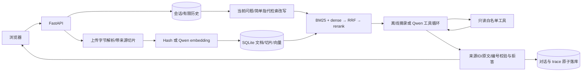

# 架构与可追问的设计选择

本项目从零独立实现，不依赖其他作品仓库，也不代表公司内部系统。

## 为什么这样取舍

- **先保留来源，再切片。** 每块只有一个页/段落来源，不跨页拼块。`start/end` 是段内字符偏移；不是字符 token 比例的伪精确估计。标题随正文继承，不能把页码猜成模型生成的字段。
- **RRF 不要求 BM25 与余弦同量纲。** 两条召回各取前 12，按 `1/(60+rank)` 加和，再对 8 条候选重排。候选并集不是最终答案；trace 保留各阶段分数。
- **重排有可比较 baseline。** 默认分数是 `0.65×query term coverage + 0.20×positive cosine + 0.15×exact phrase indicator`。可选 Qwen listwise 打分需要额外调用，非法 JSON/ID/分数直接报错，不能偷偷回退掩盖问题。
- **只读能力比提示词更硬。** 模型只能选择白名单名称；参数经过拒绝额外字段的 schema。算术仅遍历 AST 的常量、加减乘除与括号，不使用 eval/exec。没有文件/网络通用工具。
- **真实模式的失败要显式。** 缺密钥启动失败，HTTP、格式或工具预算失败有明确错误；同一套离线摘录不能伪装成 Qwen 返回。
- **会话按版本提交。** 当前问题与答案、引用元数据和 trace 在一个 SQLite 事务中写入；并发旧 revision 提交失败。失败 trace 可单独记录 error type，不写入未完成的一轮回答。
- **索引兼容性要检查。** 持久保存 embedding 后端、模型与维度的指纹；切换配置不复用旧向量。真实 embedding 逐批最多 10 条并校验返回 index 和 1024 维度。

## 能讲清楚的限制

引用完整性不等于答案蕴含关系；简单词面拒答阈值会误拒语义改写。离线模式用于工程验收，不具有大模型推理。默认哈希向量存在碰撞，不能宣称深度语义效果。语义检索、重排和模型输出都需要独立人工标注测试集。

多轮记忆是有限会话历史与简单指代检索，不是长期经验学习、自进化或自动更新权重。上下文不包含隐藏思维链。工具不能写外部系统，但文档中的恶意指令仍可能影响回答内容，当前只是能力隔离与来源校验，并未证明全面防御提示注入。

PDF 解析在应用进程内，资源上限不构成强沙箱。SQLite 的 float JSON 与全量扫描是小型可检查实现；达到 5,000 块上限后应按实际规模设计 ANN、异步摄取、任务队列、模型限流和租户权限，而不是直接放大数字。
